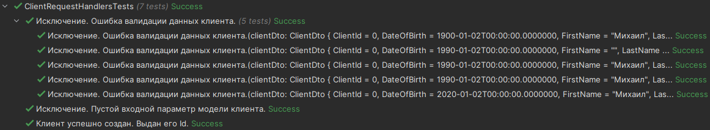
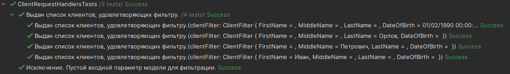
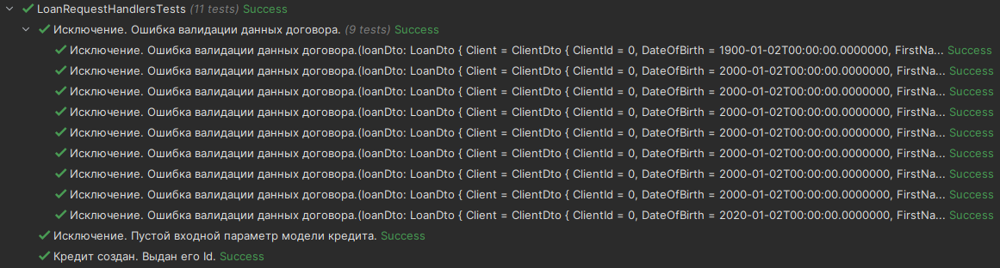

## 1. Метод создания клиента
Метод создания клиента принимает на вход данные о создаваемом клиенте. Производит валидацию данных и возвращает идентификатор созданного клиента.

<div style="text-align: right">Листинг контракта метода</div>

```csharp
/// <summary>
/// Метод создания клиента.
/// </summary>
/// <param name="clientDto">Новые данные клиента.</param>
/// <returns>Id созданного клиента.</returns>
public Task<long> CreateClient(ClientDto clientDto);
```
На основе описания метода подготовим тестовые данные и напишем тест.

Тестовые данные создаются в отдельном классе, который
представляет собой набор методов для генерации тестовых данных.

<div style="text-align: right">Листинг класса для генерации тестовых данных</div>

```csharp
public List<ClientEntity> GetClients()
    {
        List<ClientEntity> clients = new()
        {
            new()
            {
                ClientId = 1,
                FirstName = "Иван",
                MiddleName = "Петрович",
                LastName = "Орлов",
                DateOfBirth = DateTime.Parse("1990-02-01"),
                Salary = 100000
            },
    
            ...
            new()
            {
                ClientId = 4,
                FirstName = "Алексей",
                MiddleName = "Петрович",
                LastName = "Орлов",
                DateOfBirth = DateTime.Parse("1990-02-01"),
                Salary = 100000
            },
        };

        return clients;
    }
```

Тестовые данные подставляются с
помощью Substitute в конструкторе тестового класса.

<div style="text-align: right">Листинг конструктора тестового класса</div>

```csharp
    private readonly List<ClientEntity> _clients;
    private readonly IClientRequestHandlers _clientRequestHandlers;

    public ClientRequestHandlersTests()
    {
        ClientRequestHandlersTestsData clientRequestHandlersTestsData = new();
        
        IOptionsMonitor<List<ClientEntity>> clients = Substitute.For<IOptionsMonitor<List<ClientEntity>>>();
        clients.CurrentValue.Returns(clientRequestHandlersTestsData.GetClients());
        _clients = Substitute.For<List<ClientEntity>>(clients.CurrentValue);
        IClientsRepository clientsRepository = Substitute.For<ClientsRepository>(clients);
        
        IOptionsMonitor<List<LoanEntity>> loans = Substitute.For<IOptionsMonitor<List<LoanEntity>>>();
        loans.CurrentValue.Returns(clientRequestHandlersTestsData.GetLoans());

        ClientSpecification clientSpecification = new(70, 21);
        IClientValidator clientValidator = Substitute.For<ClientValidator>(clientSpecification);
        
        _clientRequestHandlers = new ClientRequestHandlers(clientsRepository, clientValidator);
    }
```

<div style="text-align: right">Листинг позитивного теста</div>

```csharp
[Fact(DisplayName = "Клиент успешно создан. Выдан его Id.")]
public async void CreateClient_ValidClientData_ClientId()
{
    // Arrange
    ClientDto clientDto = new()
    {
        ClientId = default,
        FirstName = "Михаил",
        MiddleName = "Петрович",
        LastName = "Авенариус",
        DateOfBirth = DateTime.Parse("1990-01-02"),
        Salary = 10_000
    };
    long expectedClientId = _clients.Max(clientInfo => clientInfo.ClientId) + 1;
    
    // Act
    long actualClientId = default;
    Exception? exception = await Record.ExceptionAsync(async () =>
    {
        actualClientId = await _clientRequestHandlers.CreateClient(clientDto);
    });
    
    // Assert
    Assert.Null(exception);
    Assert.Equal(expectedClientId, actualClientId);
}
```
Так же нужно проверить критерии, при которых должно выбрасываться исключения.

<div style="text-align: right">Листинг негативного теста (ошибка валидации)</div>

```csharp
[Theory(DisplayName = "Исключение. Ошибка валидации данных клиента.")]
[MemberData(nameof(GetInvalidClientsDtosObjects))]
public async void CreateClient_InvalidClientData_ClientValidationException(ClientDto clientDto)
{
    // Arrange
    // Act and Assert
    await Assert.ThrowsAsync<ClientValidationException> (() =>
    {
        return _clientRequestHandlers.CreateClient(clientDto);
    });
}
```
<div style="text-align: right">Листинг негативного теста (пустой входной параметр модели)</div>

```csharp
[Fact(DisplayName = "Исключение. Пустой входной параметр модели клиента.")]
public async void CreateClient_NullClientModelParameter_ArgumentNullException()
{
    // Arrange
    ClientDto clientDto = null;
    
    // Act and Assert
    await Assert.ThrowsAsync<ArgumentNullException> (() =>
    {
        return _clientRequestHandlers.CreateClient(clientDto);
    });
}
```
Теперь напишем реализацию метода.

<div style="text-align: right">Листинг метода</div>

```csharp
/// <inheritdoc/>
public async Task<long> CreateClient(ClientDto clientDto)
{
    if (clientDto is null)
    {
        throw new ArgumentNullException(nameof(clientDto), "Не задана модель для создания клиента.");
    }

    List<string> validationErrors = _clientValidator.Validate(clientDto);

    if (validationErrors.Count > 0)
    {
        throw new ClientValidationException(validationErrors);
    }
    
    Client client = new()
    {
        DateOfBirth = clientDto.DateOfBirth,
        FirstName = clientDto.FirstName,
        LastName = clientDto.LastName,
        MiddleName = clientDto.MiddleName,
        Salary = clientDto.Salary
    };
    long clientId = await _clientsRepository.CreateClient(client);
    
    return clientId;
}
```
<p align="center">
<br>
Рис. Результаты тестов после реализации метода</p>

## 2. Метод поиска клиента по фильтру
Метод поиска клиента принимает модель с параметрами для фильтрации и возвращает список клиентов, удовлетворяющих заданному фильтру.

<div style="text-align: right">Листинг контракта метода</div>

```csharp
/// <summary>
/// Метод по поиску клиентов через фильтр.
/// </summary>
/// <param name="clientFilter">Параметры фильтрации.</param>
/// <returns>Список клиентов, удовлетворяющих фильтру.</returns>
public Task<IReadOnlyCollection<ClientDto>> GetClientsByFilter(ClientFilter clientFilter);
```
На основе описания метода подготовим тестовые данные и напишем пишем тесты.

<div style="text-align: right">Листинг тестов метода</div>

```csharp
[Theory(DisplayName = "Выдан список клиентов, удовлетворяющих фильтру.")] 
[MemberData(nameof(GetClientFiltersObjects))]
public async void GetClientsByFilter_ValidFilter_FilteredClientsList(ClientFilter clientFilter)
{
    // Arrange
    List<ClientDto> clientDtos = new()
    {
        new()
        {
            ClientId = 1,
            FirstName = "Иван",
            MiddleName = "Петрович",
            LastName = "Орлов",
            DateOfBirth = DateTime.Parse("1990-02-01"),
            Salary = 100000
        }
    };
    List<ClientDto> expectedResult = clientDtos;
    
    // Act and Assert
    IReadOnlyCollection<ClientDto> filteredClients = await _clientRequestHandlers.GetClientsByFilter(clientFilter);
    Assert.Equivalent(expectedResult, filteredClients);
}

[Fact(DisplayName = "Исключение. Пустой входной параметр модели для фильтрации.")] 
public async void GetClientsByFilter_NullClientFilter_ArgumentNullException()
{
    // Arrange
    ClientFilter clientFilter = null;
    
    // Act and Assert
    await Assert.ThrowsAsync<ArgumentNullException> (() =>
    {
        return _clientRequestHandlers.GetClientsByFilter(clientFilter);
    });
}
```
Теперь напишем реализацию метода.

<div style="text-align: right">Листинг метода</div>

```csharp
/// <inheritdoc/>
public async Task<IReadOnlyCollection<ClientDto>> GetClientsByFilter(ClientFilter clientFilter)
{
    if (clientFilter is null)
    {
        throw new ArgumentNullException(nameof(clientFilter), "Не задан параметр модели фильтрации.");
    }

    List<ClientEntity> clientFilteredEntities = await _clientsRepository.GetClientsByFilter(clientFilter);
    IReadOnlyCollection<ClientDto> clientFilteredDtos = clientFilteredEntities
        .Select(clientInfo => new ClientDto()
        {
            ClientId = clientInfo.ClientId,
            FirstName = clientInfo.FirstName,
            MiddleName = clientInfo.MiddleName,
            LastName = clientInfo.LastName,
            DateOfBirth = clientInfo.DateOfBirth,
            Salary = clientInfo.Salary
        })
        .ToList()
        .AsReadOnly();
    
    return clientFilteredDtos;
}
```

<p align="center">
<br>
Рис. Результаты тестов после реализации метода</p>

## 3. Метод создания кредита
Метод создания клиента принимает на вход данные о создаваемом кредитном контракте.
Производит валидацию данных и возвращает идентификатор созданного кредитного контракта.

<div style="text-align: right">Листинг контракта метода</div>

```csharp
    /// <summary>
    /// Метод создания заявки на кредит.
    /// </summary>
    /// <param name="loanDto"><see cref="LoanDto"/></param>
    /// <returns>Id созданного кредита.</returns>
    public Task<Guid> CreateLoan(LoanDto loanDto);
```
На основе описания метода подготовим тестовые данные напишем тест.

<div style="text-align: right">Листинг тестов метода</div>

```csharp
[Fact(DisplayName = "Кредит создан. Выдан его Id.")]
    public async void CreateLoan_ValidLoanData_LoanId()
    {
        // Arrange
        LoanDto loanDto = new()
        {
            Client = new()
            {
                FirstName = "Александр",
                LastName = "Пушкин",
                DateOfBirth = DateTime.Parse("2000-01-02"),
                Salary = 2500
            },
            LoanAmount = 1250,
            LoanTermInMonths = 14
        };
 
        //Act
        Guid loanId = await _loanRequestHandlers.CreateLoan(loanDto);
        LoanDto actualLoanDto = await _loanRequestHandlers.GetLoanByLoanId(loanId);
        
        // Assert
        Assert.Equal(loanId, actualLoanDto.LoanId);
        Assert.Equivalent(loanDto.Client, actualLoanDto.Client);
        Assert.Equal(loanDto.CreationDate, actualLoanDto.CreationDate);
        Assert.Equal(loanDto.LoanAmount, actualLoanDto.LoanAmount);
        Assert.Equal(loanDto.LoanTermInMonths, actualLoanDto.LoanTermInMonths);
    }
    
    [Fact(DisplayName = "Исключение. Пустой входной параметр модели кредита.")] 
    public async void CreateLoan_NullLoanDto_ArgumentNullException()
    {
        // Arrange
        LoanDto loanDto = null;
        
        // Act and Assert
        await Assert.ThrowsAsync<ArgumentNullException> (() =>
        {
            return _loanRequestHandlers.CreateLoan(loanDto);
        });
    }
    
    [Theory(DisplayName = "Исключение. Ошибка валидации данных договора.")]
    [MemberData(nameof(GetInvalidLoansDtosObjects))]
    public async void CreateLoan_InvalidData_LoanValidationException(LoanDto loanDto)
    {
        // Arrange
        // Act and Assert
        await Assert.ThrowsAsync<LoanValidationException> (() =>
        {
            return _loanRequestHandlers.CreateLoan(loanDto);
        });
    }
```

Теперь напишем реализацию метода.

<div style="text-align: right">Листинг метода</div>

```csharp
/// <inheritdoc/>
    public async Task<Guid> CreateLoan(LoanDto loanDto)
    {
        if (loanDto is null)
        {
            throw new ArgumentNullException(nameof(loanDto), "Не задана модель для создания кредитного контракта.");
        }

        List<string> validationErrors = _loanValidator.Validate(loanDto);

        if (validationErrors.Count > 0)
        {
            throw new LoanValidationException(validationErrors);
        }
        
        CalculateDecisionQuery calculateDecisionQuery = new()
        {
            ApplicationDate = loanDto.CreationDate,
            CreditAmount = loanDto.LoanAmount,
            CreditLenMonth = loanDto.LoanTermInMonths,
            ClientId = loanDto.Client.ClientId,
            BirthDay = loanDto.Client.DateOfBirth,
            IncomeAmount = loanDto.Client.Salary
        };
        DecisionStatus decisionStatus = await _decisionMakerServiceClient.CalculateDecision(calculateDecisionQuery);
        LoanStatus loanStatus;
        switch (decisionStatus)
        {
            case DecisionStatus.Approval:
                loanStatus = LoanStatus.Approved;
                break;
            case DecisionStatus.Refuse:
                loanStatus = LoanStatus.Denied;
                break;
            case DecisionStatus.Underwriting:
                loanStatus = LoanStatus.InProgress;
                break;
            default:
                loanStatus = LoanStatus.Unknown;
                break;
        }

        Client client = new()
        {
            ClientId = loanDto.Client.ClientId,
            FirstName = loanDto.Client.FirstName,
            MiddleName = loanDto.Client.MiddleName,
            LastName = loanDto.Client.LastName,
            DateOfBirth = loanDto.Client.DateOfBirth,
            Salary = loanDto.Client.Salary
        };
        Loan loan = new()
        {
            LoanId = loanDto.LoanId,
            Client = client,
            LoanAmount = loanDto.LoanAmount,
            LoanTermInMonths = loanDto.LoanTermInMonths,
            InterestRate = loanDto.InterestRate,
            CreationDate = loanDto.CreationDate,
            Status = loanStatus,
            RejectionReason = loanDto.RejectionReason
        };

        Guid loanId = await _loansRepository.CreateLoan(loan);
        
        return loanId;
    }
```

<p align="center">
<br>
Рис. Результаты тестов после реализации метода</p>